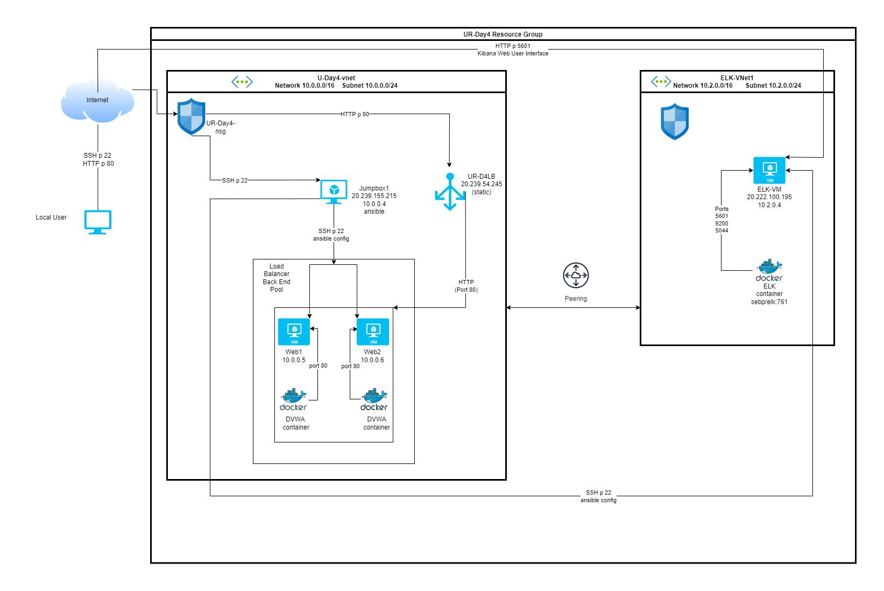
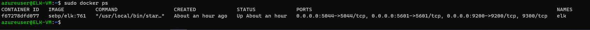
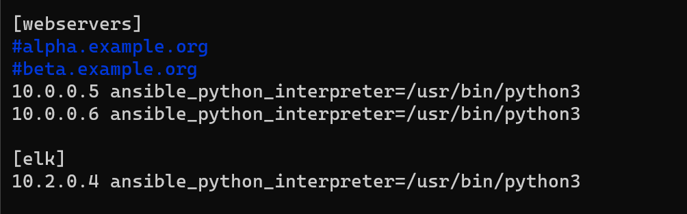
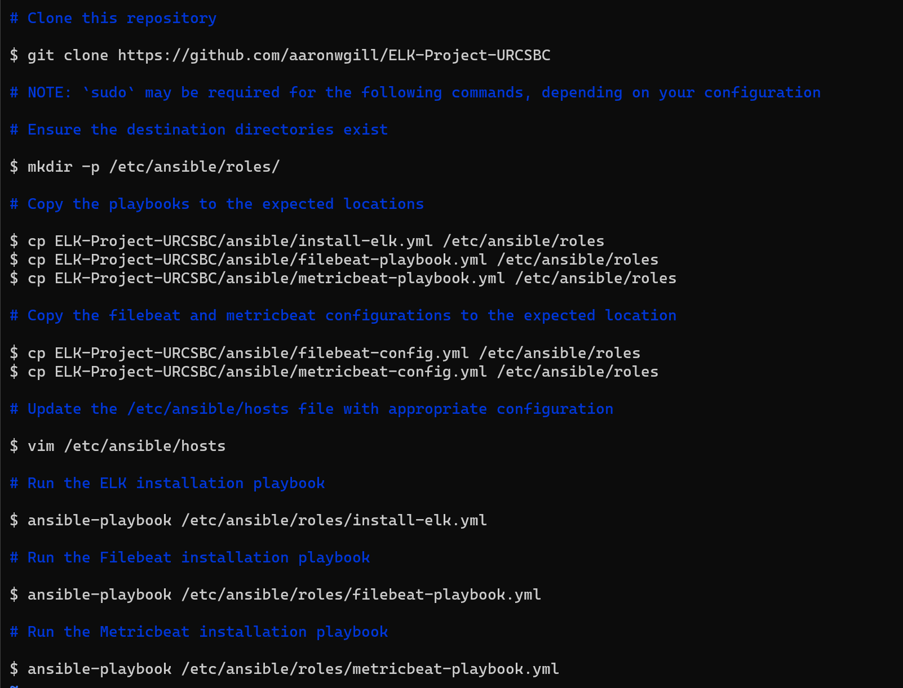

## Automated ELK Stack Deployment

The files in this repository were used to configure the network depicted below.

These files have been tested and used to generate a live ELK deployment on Azure. They can be used to either recreate the entire deployment pictured above. Alternatively, select portions of the ansible playbook files may be used to install only certain pieces of it, such as Filebeat.

  - [Elk Installation Playbook](./Ansible/install-elk.yml) installs and configures the ELK server
  - [Filebeat Playbook](./Ansible/filebeat-playbook.yml) installs and configures Filebeat on the target virtual machines
  - [Metricbeat Playbook](./Ansible/metricbeat-playbook.yml) installs and configures Metricbeat on the target virtual machines

This document contains the following details:
- Description of the Network Topology
- Access Policies
- ELK Configuration
  - Beats in Use
  - Machines Being Monitored
- How to Use the Ansible Build

### Description of the Network Topology

The main purpose of this network is to expose a load-balanced and monitored instance of DVWA, the Damn Vulnerable Web Application.

Load balancing ensures that the application will be highly available, in addition to restricting access to the network.
- The use of a load balancer prohibits direct access from the internet to the DVWA machines. This also prohibits SSH connections that are unauthorized outside the network. Using a Jump Box ensures that access is only attainable from the docker container that is running on the Jump Box machine.

Integrating an ELK server allows users to easily monitor the vulnerable VMs for changes to the metrics and system logs.
- **Filebeat** monitors the system logs of both DVWA machines
- **Metricbeat** monitors the metrics (network I/O, CPU usage and load, and memory pressure) of the DVWA machines

The configuration details of each machine may be found below.

| Name     | Function | IP Address | Operating System |
|----------|----------|------------|------------------|
| Jumpbox1 | Gateway  | 10.0.0.4   | Linux            |
| Web1     | DVWA     | 10.0.0.5   | Linux            |
| Web2     | DVWA     | 10.0.0.6   | Linux            |
| ELK-VM   | ELK Stack| 10.2.0.4   | Linux            |

### Access Policies

The machines on the internal network are not exposed to the public Internet. 

Only the Jumpbox1 machine can accept connections from the Internet. Access to this machine is only allowed from the following IP addresses:
- My Local Workstation public IP address 73.152.144.XXX

Machines within the network can only be accessed by Jumpbox1 via SSH port 22.
- Which machine did you allow to access your ELK VM? 
- Jumpbox1 IP address 10.0.0.4 

A summary of the access policies in place can be found in the table below.

| Name     | Publicly Accessible | Allowed IP Addresses |
|----------|---------------------|----------------------|
| Jumpbox1 | Yes                 | 73.152.144.XXX       |
| Web1     | No                  | 10.0.0.4             |
| Web2     | No                  | 10.0.0.4             |
| ELK-VM   | No                  | 10.0.0.4             |

### Elk Configuration

Ansible was used to automate configuration of the ELK machine. No configuration was performed manually, which is advantageous because it reduces the risk of mistakes and/or typos when configuring the machine.

There were three playbooks that were used to implement the following tasks:

* [ELK Installation Playbook](./Ansible/install-elk.yml)
  * Selects the taget machine (ELK-VM) by stating which hosts the ELK Stack will be installed
  * Installs docker.io package using 'apt'
  * Installs Python3-pip using 'apt'
  * Installs the docker module using 'pip'
  * Increases the memory of the target machine using the 'sysctl' module
  * Downloads and launches the docker container for the ELK Stack using the published ports

* [Filebeat Installation Playbook](./Ansible/filebeat-playbook.yml)
  * Selects the target machines (Web1 & Web2) by stating which hosts Filebeat will be installed
  * Downloads and installs Filebeat 
  * Copies the Filebeat configuration file to the target machines
  * Enables and configures Filebeat on the target machines
  * Completes setup and starts the Filebeat service on the target machines 

* [Metricbeat Installation Playbook](./Ansible/metricbeat-playbook.yml)
  * Selects the target machines (Web1 & wWeb2) by stating which hosts Metricbeat will be installed
  * Downloads and installs Metricbeat to the target machines 
  * Copies the Metricbeat configuration file to the target machines
  * Enables and configures Metricbeat on the target machines
  * Completes setup and starts the Metricbeat service on the target machines 

The following screenshot displays the result of running `docker ps` after successfully configuring the ELK instance.

### Target Machines & Beats
This ELK server is configured to monitor the following machines:
 * Web1
 * Web2

We have installed the following Beats on these machines:
 * Filebeat
 * Metricbeat

These Beats allow us to collect the following information from each machine:
 * 'Filebeat' allows us to monitor the system logs of both DVWA machines. It collects system logs and allows us to view information like failed logins, failed processes, downloaded files and their types, host information for each system log collected.
 * 'Metricbeat' collects the metrics (network I/O, CPU usage and load, and memory pressure) of the DVWA machines and allows us to view the data collected in the Discover section of Kibana. This allows us to see the state of each machine when each log is created.

### Using the Playbook
In order to use the playbook, you will need to have an Ansible control node already configured. Assuming you have such a control node provisioned: 

SSH into the control node and follow the steps below:
- Copy the three playbook files to the '/etc/ansible/roles' directory on your Jump Box VM (Your provisioning machine).
- Update the '/etc/ansible/hosts' file to include a group called 'webservers' which will contain the private IP addresses of the machines you want to monitor. You will also need to create a group called 'elk' which will contain the private IP of your machine that will be running the ELK Stack.

An example of what your groups should look like is shown below:

- Run the playbook, and navigate to 'http://<PUBLIC ip OF ELK SERVER>:5601' to check that the installation worked as expected.

- Which file is the playbook? 'filebeat-playbook.yml'
- Where do you copy it? '/etc/ansible/roles'
- Which file do you update to make Ansible run the playbook on a specific machine? '/etc/ansible/hosts' use the private IP addresses of the Virtual Machines
- How do I specify which machine to install the ELK server on versus which to install Filebeat on? You would specify two separate groups in the host file. The first would be the 'webservers' group containing the private IP addresses of the machines you want to run filebeat (these would be your DVWA machines). The second group would be the 'elk' group containing the private IP address of the Virtual Machine that you want running your ELK Server.
- Which URL do you navigate to in order to check that the ELK server is running? http://<PUBLIC IP OF ELK SERVER VM>/setup.php

Below are the exact commands you would need to run from the Jump Box VM

